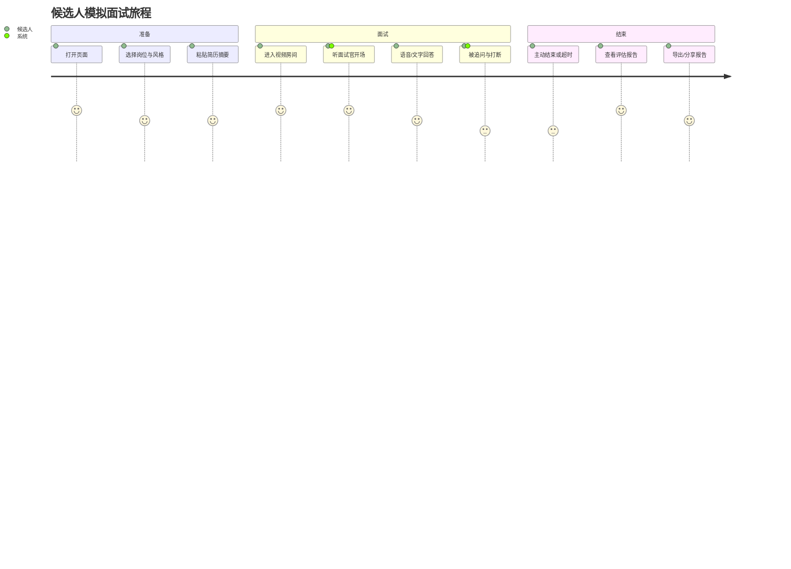
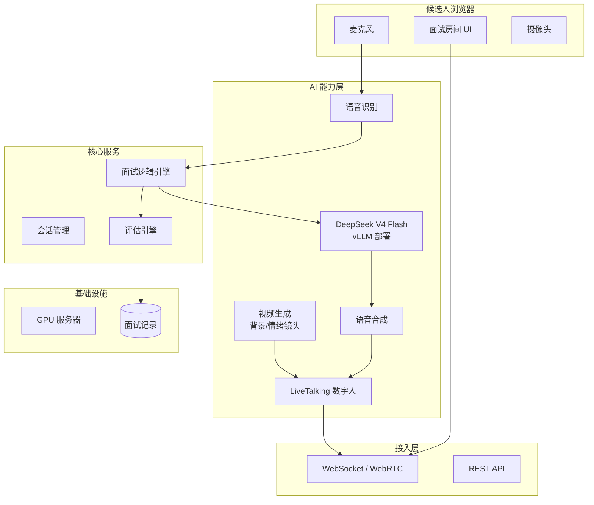
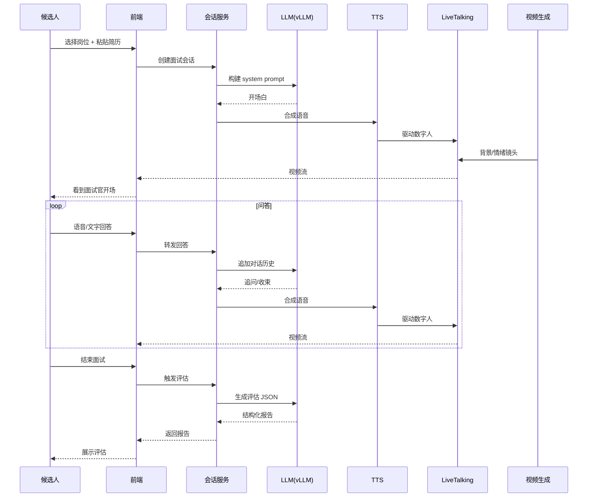
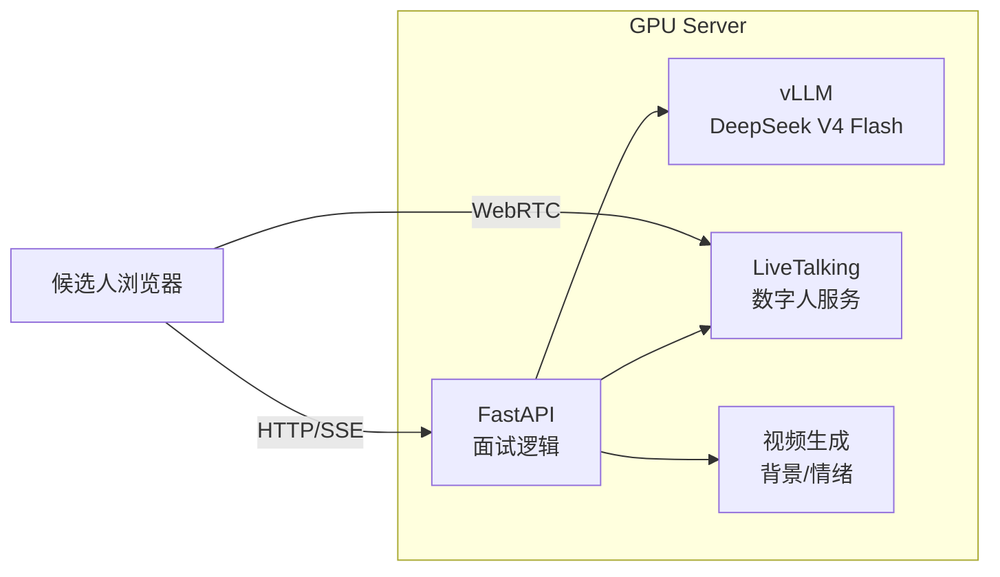

# 虚拟面试官系统需求分析

> 版本：v0.1（需求基线）  
> 日期：2026-08-29  
> 状态：待评审

---

## 1. 项目概述

### 1.1 背景
传统模拟面试依赖真人面试官，成本高、时间难约、反馈主观。大模型与实时数字人技术成熟后，可以构建一个随时可用、反馈结构化的虚拟面试官，帮助候选人反复练习，也帮助企业做初筛。

### 1.2 目标
- 候选人端：提供一场接近真实体验的模拟面试，包含视频形象、语音交互与结构化评估。
- 企业端（后续）：提供可配置的岗位题库、面试记录与人才画像。
- 技术端：验证「实时视频生成 + 语音 + LLM」在严肃对话场景下的可用性。

### 1.3 范围
- **本期（MVP）**：单岗位、单并发、完整面试流程（开场 → 问答 → 结束 → 评估）。
- **下期（完整产品）**：多岗位、多并发、管理后台、数据沉淀、企业级部署。

### 1.4 非目标
- 不替代真人终面，仅用于练习与初筛。
- 不做简历自动解析（MVP 阶段手动粘贴）。
- 不做实时视频生成的面试官主体（MVP 用 LiveTalking 数字人，视频生成仅做背景/情绪镜头）。

---

## 2. 目标用户与核心场景

### 2.1 目标用户
| 用户 | 诉求 | 使用场景 |
|------|------|----------|
| 求职者 | 低成本反复练习，获得结构化反馈 | 面试前准备、转行准备 |
| HR / 招聘经理 | 快速初筛，标准化评估 | 校招/社招初面 |
| 培训机构 | 可配置的面试模拟工具 | 课程配套练习 |

### 2.2 核心场景
1. **模拟面试**：候选人选择岗位 → 粘贴简历 → 开始视频面试 → 获得评估报告。
2. **岗位定制**（下期）：HR 上传 JD → 系统自动生成面试问题 → 候选人链接进入。
3. **复盘回放**（下期）：面试结束后回看视频、文字记录与评分依据。

---

## 3. 用户旅程（MVP）



---

## 4. 功能需求

### 4.1 MVP（第一阶段）

| 模块 | 需求 | 优先级 | 备注 |
|------|------|--------|------|
| 岗位配置 | 内置 5 个岗位预设（后端/前端/算法/产品/客户端） | P0 | 支持自定义 JD |
| 简历输入 | 文本框粘贴简历摘要 | P0 | 不做文件解析 |
| 面试房间 | 视频窗口 + 文字记录 + 语音输入按钮 | P0 | Web 端 |
| 面试官形象 | LiveTalking 数字人（wav2lip/musetalk/ultralight） | P0 | 实时口型同步 |
| 背景/情绪镜头 | 视频生成模型生成背景或情绪短片 | P1 | 可关闭 |
| 语音输入 | 浏览器 Web Speech API 或本地 ASR | P0 | 支持打断 |
| 语音输出 | TTS 合成面试官语音 | P0 | 支持打断 |
| 面试逻辑 | LLM 驱动追问、收束、结束 | P0 | 基于 DeepSeek V4 Flash |
| 评估报告 | 综合分、维度分、加分/风险、下一轮建议 | P0 | JSON + 页面展示 |
| 会话管理 | 单场面试创建、进行、结束、查询 | P0 | 内存态即可 |

### 4.2 完整产品（第二阶段）

| 模块 | 需求 | 优先级 |
|------|------|--------|
| 多岗位题库 | 岗位 → 问题库 → 追问策略 | P1 |
| 用户体系 | 候选人/HR 账号、权限 | P1 |
| 面试记录 | 视频回放、文字记录、评分历史 | P1 |
| 管理后台 | 岗位配置、面试监控、数据看板 | P1 |
| 多并发 | 支持 N 路同时面试 | P1 |
| 企业部署 | 私有 GPU 集群、SSO、审计日志 | P2 |
| 全视频生成 | 面试官主体由视频生成模型驱动 | P2 |

---

## 5. 非功能需求

| 类别 | 指标 | 目标 |
|------|------|------|
| 延迟 | 语音输入到面试官开口 | < 1.5s（MVP），< 800ms（优化后） |
| 延迟 | 视频口型同步 | < 200ms |
| 并发 | MVP | 1 路 |
| 并发 | 完整产品 | 50+ 路 |
| 可用性 | 单场面试成功率 | > 99% |
| 安全 | 对话数据 | 本地/私有部署，不出内网 |
| 兼容 | 浏览器 | Chrome / Edge 最新版 |

---

## 6. 系统架构

### 6.1 总体架构（可插拔）



### 6.2 模块职责

| 模块 | 职责 | 技术选型 |
|------|------|----------|
| 前端 | 面试房间、视频渲染、语音采集 | React / Vue + WebRTC |
| 接入层 | 信令、音视频传输、会话控制 | WebRTC (WHEP) + WebSocket |
| 会话管理 | 面试状态机、上下文缓存 | Python / Node |
| 面试逻辑 | 问题生成、追问策略、收束 | Prompt 工程 + DeepSeek V4 Flash |
| 评估引擎 | 结构化评分、报告生成 | LLM JSON 输出 |
| ASR | 语音转文字 | 本地 Whisper / 浏览器 API |
| TTS | 文字转语音 | Edge-TTS / 本地 TTS |
| 数字人 | 口型同步、形象渲染 | LiveTalking |
| 视频生成 | 背景、情绪镜头 | 可插拔（Veo / Kling / 自研） |
| LLM 服务 | 面试官大脑 | vLLM + DeepSeek V4 Flash |

### 6.3 数据流（单场面试）



---

## 7. 接口契约（MVP）

### 7.1 REST API

| 方法 | 路径 | 说明 |
|------|------|------|
| GET | `/api/meta` | 获取岗位预设、模型状态 |
| POST | `/api/sessions` | 创建面试会话 |
| GET | `/api/sessions/{id}` | 查询会话状态与记录 |
| POST | `/api/sessions/{id}/chat` | 发送回答（SSE 流式返回） |
| POST | `/api/sessions/{id}/report` | 生成评估报告 |
| POST | `/offer` 或 `/whep` | WebRTC 信令（LiveTalking） |

### 7.2 WebSocket / SSE 事件

| 事件 | 方向 | 说明 |
|------|------|------|
| `delta` | S→C | 面试官文字流式输出 |
| `thinking` | S→C | 面试官正在思考 |
| `done` | S→C | 本轮结束 |
| `error` | S→C | 错误信息 |
| `audio` | S→C | TTS 音频流（可选） |
| `video` | S→C | WebRTC 视频流 |

---

## 8. 数据模型

### 8.1 面试会话

```json
{
  "id": "uuid",
  "created_at": "2026-08-29T13:00:00Z",
  "config": {
    "role": "后端工程师",
    "company": "支付中台",
    "jd": "...",
    "resume": "...",
    "style": "probe",
    "rounds": 8
  },
  "messages": [
    {"role": "system", "content": "..."},
    {"role": "assistant", "content": "..."},
    {"role": "user", "content": "..."}
  ],
  "phase": "interviewing | closing | done",
  "turns": 5,
  "report": {}
}
```

### 8.2 评估报告

```json
{
  "overall": 78,
  "recommendation": "lean_hire",
  "level_guess": "中级偏上",
  "dimensions": [
    {"name": "技术深度", "score": 75, "note": "..."}
  ],
  "strengths": ["..."],
  "risks": ["..."],
  "evidence": [{"quote": "...", "why": "..."}],
  "next_round_focus": ["..."],
  "summary": "..."
}
```

---

## 9. 技术选型与依赖

| 组件 | 选型 | 备注 |
|------|------|------|
| 前端框架 | React 18 + TypeScript | 或 Vue 3 |
| 音视频传输 | WebRTC (WHEP) | LiveTalking 原生支持 |
| 后端框架 | FastAPI | 异步、SSE 友好 |
| LLM 服务 | vLLM | OpenAI 兼容接口 |
| LLM 模型 | deepseek-v4-flash-0731 | 284B MoE，13B 激活 |
| ASR | 浏览器 Web Speech API / Whisper.cpp | MVP 用浏览器，后期本地 |
| TTS | Edge-TTS / 本地 TTS | 支持打断 |
| 数字人 | LiveTalking (wav2lip/musetalk/ultralight) | 实时口型 |
| 视频生成 | 可插拔（Veo / Kling / 自研扩散） | MVP 仅背景/情绪镜头 |
| 部署 | Docker Compose | 后期 K8s |

---

## 10. 部署与运维

### 10.1 GPU 服务器要求（MVP）

| 项目 | 配置 |
|------|------|
| GPU | 1× A100 80G 或 2× RTX 4090（vLLM） |
| CPU | 16 核+ |
| 内存 | 64GB+ |
| 存储 | 500GB SSD（模型 + 视频缓存） |
| 网络 | 内网千兆，外网可选 |

### 10.2 部署架构



### 10.3 监控指标
- LLM 首 token 延迟、吞吐
- TTS 合成延迟
- 视频帧率与口型同步误差
- 面试成功率、平均时长

---

## 11. 风险与开放问题

| 风险 | 影响 | 缓解 |
|------|------|------|
| DeepSeek V4 Flash 显存不足 | 无法本地部署 | 使用百炼/私有 API，或等待量化版本 |
| 视频生成延迟高 | 破坏实时感 | MVP 仅做背景/情绪，主体用 LiveTalking |
| 语音打断不自然 | 体验差 | 预留端到端实时语音接口 |
| 评估主观性 | 候选人质疑 | 输出对话依据，允许人工复核 |
| 多并发资源争抢 | 服务不稳定 | MVP 单并发，后期队列 + 限流 |

### 开放问题
1. 视频生成模型的具体选型与接入方式？
2. 端到端实时语音（如 Qwen-Omni）是否值得在 MVP 后立刻接入？
3. 企业级部署的合规与审计要求？
4. 面试题库的建设与运营机制？

---

## 12. 里程碑

| 阶段 | 目标 | 时间 |
|------|------|------|
| M1 | 需求文档评审通过 | 本周 |
| M2 | MVP 技术验证（单路跑通） | 2 周 |
| M3 | MVP 内测（10 人试用） | 4 周 |
| M4 | 完整产品规划启动 | 6 周 |

---

## 附录

### A. 术语
- **LiveTalking**：开源实时数字人引擎，支持口型同步与 WebRTC 推流。
- **vLLM**：高吞吐 LLM 推理框架，支持 OpenAI 兼容 API。
- **WHEP**：WebRTC HTTP Egress Protocol，用于拉流。

### B. 参考
- LiveTalking 文档：`/Users/leon/Workspace/LiveTalking/docs/api.md`
- DeepSeek V4 Flash 部署：`https://unsloth.ai/docs/models/deepseek-v4`
